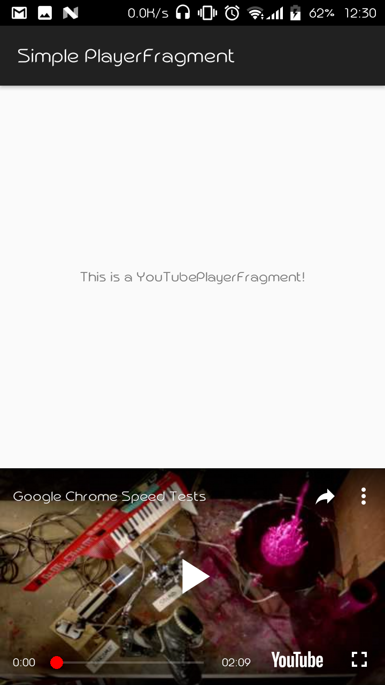
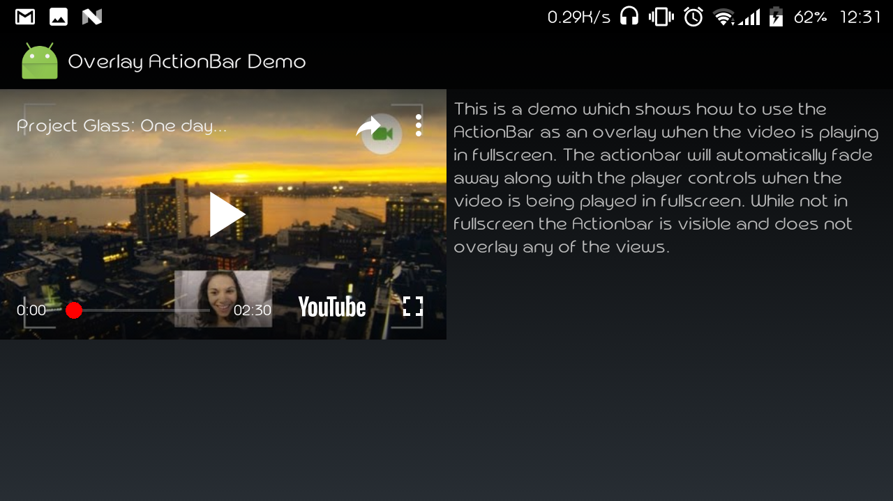

Copyright 2014 Google, Inc. All rights reserved.

YouTube Android Player API
==========================

Description:
-------------------

This API provides developers with the capability to embed YouTube videos into
their Android Apps.

The API is packaged as a jar file which can be added to an application's
build path to provide YouTube embedding capability. More details about using
this API can be found at:

  http://developers.google.com/youtube/android/player/

Build Requirements:
-------------------

Android SDK tools r20 or above (http://developer.android.com/sdk/)

Contents:
---------
docs - Javadoc reference for the API

This repo contains the samples as they are from the youtube api references
with minor cleanups.

Sample Screenshots:
----------

|   |  |  | | |
|:---:|:---:|:---:|:---:|:---:|
| |  |  |  | |
